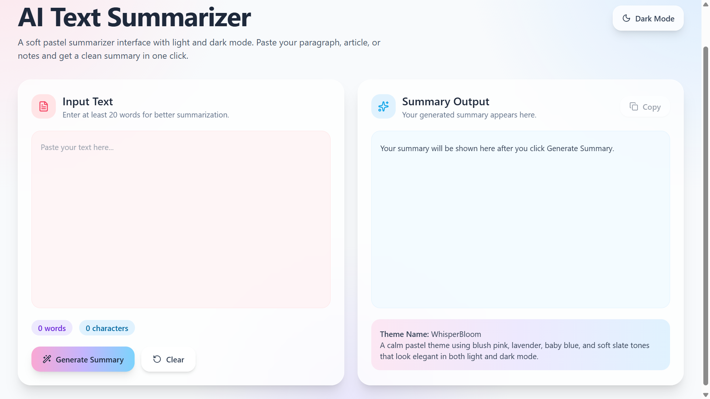
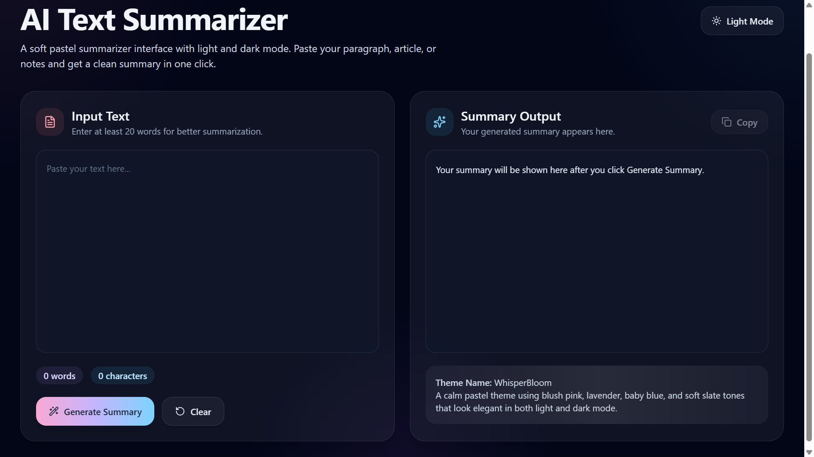
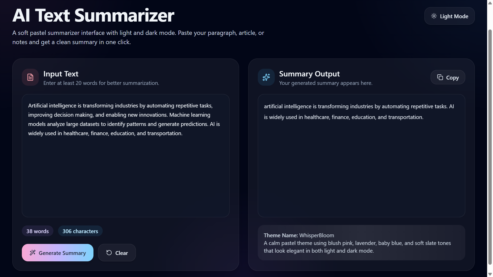

# Text_Summarizer
## Abstract

This project is an AI-powered text summarization application built using FastAPI and a React-based frontend. It leverages advanced Natural Language Processing (NLP) techniques and the T5 transformer model to generate concise, context-aware, and meaningful summaries from large text inputs. The system demonstrates key NLP capabilities such as text understanding, sequence-to-sequence learning, contextual encoding, and abstractive summarization. It is designed with a user-friendly interface using a soft pastel theme called WhisperBloom, supporting both light and dark modes. Users can input long paragraphs and instantly receive high-quality summaries, improving readability and saving time. This project highlights the practical application of deep learning-based NLP models integrated with modern web technologies. It is ideal for students, researchers, and professionals who require efficient and intelligent text processing.

---

## Screenshots

### WhisperBloom Light Theme
A clean and soft pastel interface designed for comfortable readability in light mode.  

### WhisperBloom Dark Theme
A visually balanced dark mode with subtle pastel highlights for reduced eye strain.  

###  AI Generated Summary Output
Displays concise and meaningful summaries generated from long text inputs.  

